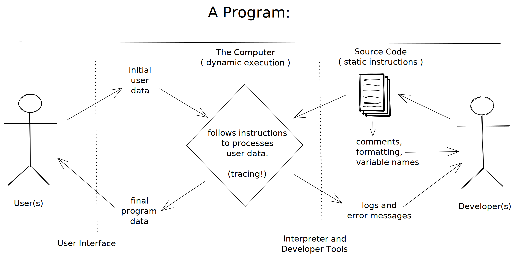

# The Humans

For now there are two types of human you should think about when you read or
write code: _developers_ and _users_. The real world doesn't split so nicely
into two categories but it's helpful to get started.

Just think of yourself! You'll be writing programs _and_ using them to make sure
they work, taking turns being the developer and the user.

## Developers

Developers are the ones designing the software, writing the code, and fixing the
bugs. As a developer you'll spend lots of time reading source code. So it's very
important to make sure your code is easy to understand.

You should think first of other developers who will need to understand your
program, and second of yourself. Why is this more productive? First because
working on a team is easier when everyone is looking out for each other. Second
because one day you'll be someone else! After even half an hour your thoughts
about a program are no longer fresh, you'll need to rely on what you wrote to
figure out the details of your own program.

## Users

Users will use your running programs, but will never see your source code. When
writing for a user you need to think of their needs and their experience using
your program.

For now the user experience of your programs will be limited to pop-up boxes,
but that doesn't mean you can't think of UX (User Experience). A user always
appreciates  clear instructions, helpful feedback and a friendly tone in your
messages.

How does thinking of a user help you write code that they will never see? It's
about keeping the big picture in mind and making priorities. It's easy to get
caught up in the details of your code, taking a step back to remember who you're
developing for and why they need this program keeps your priorities in
perspective.

---

## Programs: Users and Developers

Users and on the left in this diagram, developers are on the right.

- **For Developers**
  - **Static**: Comments, variable names and code formatting help developers
    read and understand source code.
  - **Dynamic**: Logs and error messages help developers understand what is
    happening inside the computer as it follows the code's instructions.
- **For Users**
  - **Inputting Data**: `prompt` is a simple way for users to input data to a
    JavaScript program.
  - **Outputting Data**: `alert` is a simple way for the computer to display
    data to a user.

